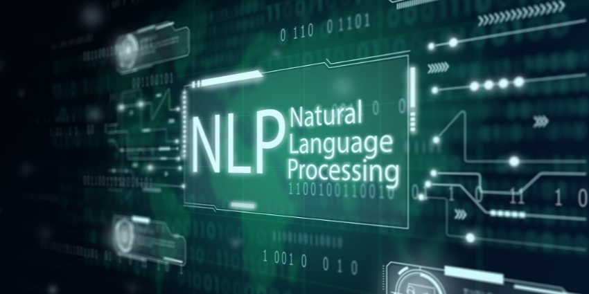
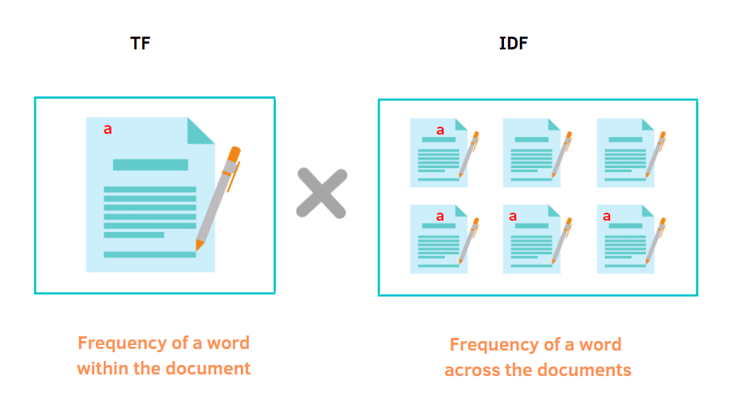
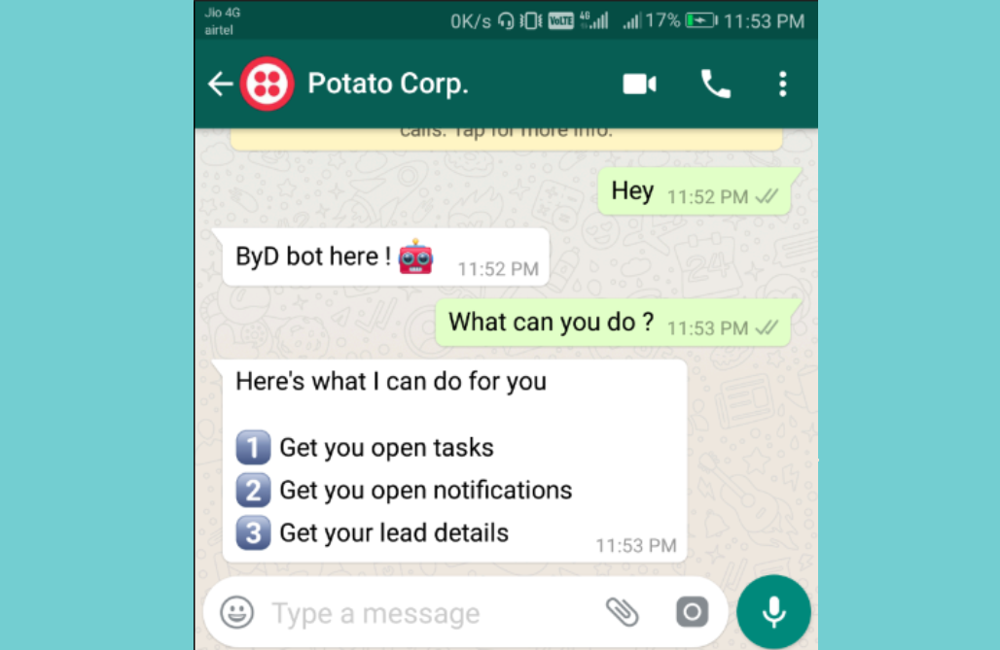
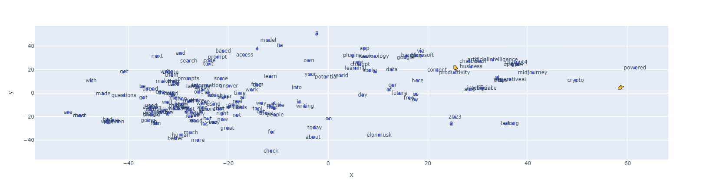
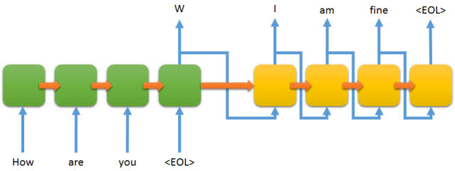

# Desafíos-NLP-CEIA

Repositorio para los desafíos de Procesamiento de Lenguaje Natural

Alumno: Ing. Jonathan Corallo

---

## [Desafío 1: Vectorización de texto](https://github.com/JonaC22/Desafios-NLP-CEIA/blob/main/desafio-1/desafio-1.ipynb)

El desafío se centra en la vectorización de texto, una técnica esencial en el procesamiento del lenguaje natural que convierte el texto en una representación numérica que las máquinas pueden entender. Se utiliza el método TF-IDF (Frecuencia de Término - Frecuencia Inversa de Documento) para vectorizar un conjunto de documentos de texto. Este método permite resaltar la importancia de las palabras en función de su frecuencia en un documento y su rareza en el corpus general.

## [Desafío 2: Bot "simple"](https://github.com/JonaC22/Desafios-NLP-CEIA/blob/main/desafio-2/desafio-2.ipynb)

Este desafío se centra en la creación de un bot de chat simple. Este bot puede responder a consultas abiertas y respuestas predeterminadas para servicios médicos utilizando DNN y Spacy. Aunque no utiliza técnicas de procesamiento de lenguaje natural avanzadas, sirve como un primer acercamiento a la construcción de interfaces de chat, el entrenamiento y la gestión de la interacción del usuario.

## [Desafío 3: Word Embedding](https://github.com/JonaC22/Desafios-NLP-CEIA/blob/main/desafio-3/desafio-3.ipynb)

En este desafío se explora la técnica de word embedding. Esta técnica transforma palabras en vectores de alta dimensión que capturan su significado semántico. Se utiliza el algoritmo Word2Vec para generar embeddings y se demuestra cómo estos pueden capturar relaciones semánticas entre palabras.

## [Desafío 4: Predicción de la siguiente palabra](https://github.com/JonaC22/Desafios-NLP-CEIA/blob/main/desafio-4/desafio-4.ipynb)

Este desafío es una exploración de las técnicas de procesamiento del lenguaje natural (NLP), centrándose específicamente en el desarrollo de un predictor de la siguiente palabra. Se entrena un modelo en un conjunto de datos de tweets sobre ChatGPT.

Las técnicas aplicadas en este desafío incluyen tokenización, embeddings, LSTM bidireccional, y modelado de secuencias con PyTorch. Estas técnicas permiten que el modelo aprenda los patrones y estructuras complejos en el uso del lenguaje y genere predicciones para la siguiente palabra en una oración.

## [Desafío 5: Análisis de sentimientos](https://github.com/JonaC22/Desafios-NLP-CEIA/blob/main/desafio-5/desafio-5.ipynb)

Este desafío se centra en el análisis de sentimientos, una tarea de NLP que implica determinar la actitud o emoción expresada en un texto. Se construye un modelo que puede clasificar las reseñas de compradores de ropa como positivas o negativas basándose en el texto de la reseña. Este desafío implica el uso de técnicas de preprocesamiento de texto, vectorización, embeddings pre-entrenados de Fasttext y modelado de clasificación con Keras.

## [Desafío 6: Bot conversacional](https://github.com/JonaC22/Desafios-NLP-CEIA/blob/main/desafio-6/desafio-6.ipynb)

En el desafío final, se combinan las técnicas aprendidas en los desafíos anteriores, embeddings pre-entrenados de Glove y modelado de encoder-decoder con Tensorflow para construir un bot de chat conversacional con el objetivo de responder preguntas del usuario (QA). Este bot puede manejar interacciones más complejas y naturales con los usuarios, respondiendo a una variedad de consultas. Para este desafío, el bot se entrena en un conjunto de datos del challenge [ConvAI2 (Conversational Intelligence Challenge 2)](http://convai.io/data/) de conversaciones en inglés.
